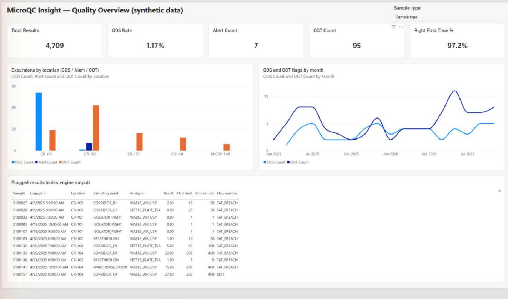
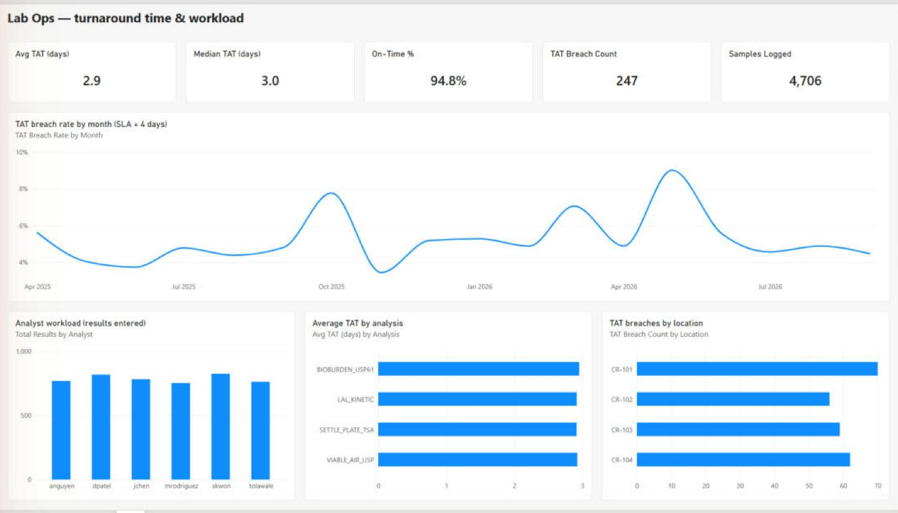
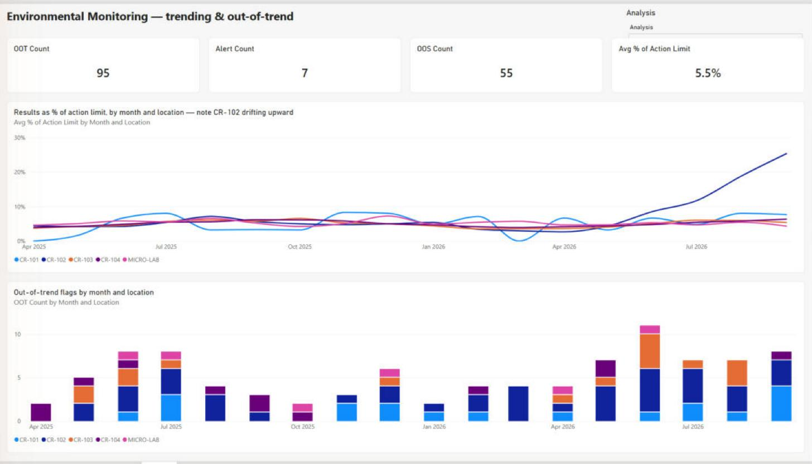
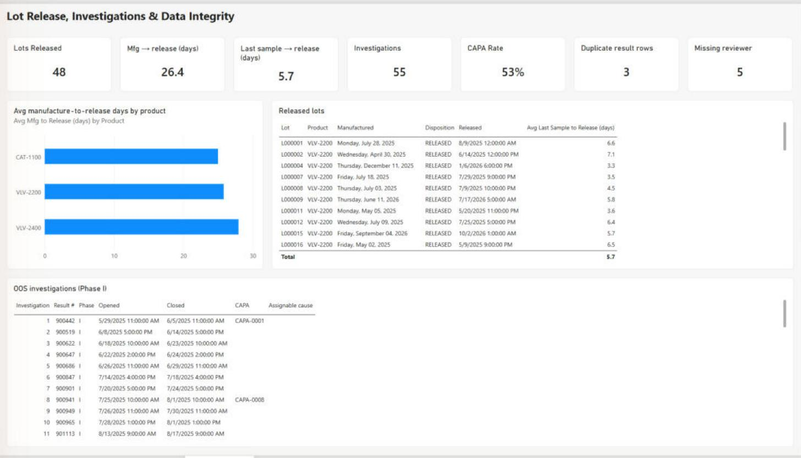

# MicroQC Insight

A portfolio project demonstrating QC lab data analytics and automation
skills, modeled on **LabWare LIMS**'s publicly documented structure. Built
by Dennis Nguyen (Quality Microbiology Lab Technician → QA Automation
Engineer transition).

> **This is a portfolio project, not a real LabWare deployment.** All data
> is 100% synthetic (generated with Python/Faker/NumPy, seeded and
> reproducible). No Edwards Lifesciences data, no real LabWare system
> access, and no real patient/product data are used anywhere here. Field
> names and table structure are *modeled on* publicly documented LabWare
> conventions (see "How this maps to LabWare" below) — they are not a copy
> of any real installation's schema, which every LabWare site customizes
> heavily.

## Dashboard preview

| Quality Overview | Lab Ops |
|---|---|
|  |  |
| **EM Trending** | **Lot Release & Investigations** |
|  |  |

## What this is

A QC microbiology lab (environmental monitoring, bioburden, endotoxin)
generates thousands of test results a year. This project simulates that
data flow end to end:

```
Synthetic LIMS data (generate_mock_labware.py)
        │
        ▼
"Stored Query" CSV export (stored_query_export.csv)
  — same Table.Field header convention LabWare's own CSV
    import/export uses
        │
        ▼
Rules engine (rules_engine.py)
  — OOS / Alert / OOT / TAT flagging, unit-tested
        │
        ▼
Automation CLI (lims_watchdog.py)
  — schema validation + rejection, flagged_results.csv,
    weekly Excel report
        │
        ├──► Power BI dashboard (4 pages: Quality Overview, Lab Ops,
        │     EM Trending, Lot Release & Investigations)
        │
        └──► Weekly report (reports/weekly_summary_<date>.xlsx)
```

## Why it's built this way

"QA Automation Engineer" in pharma/medtech usually means testing *validated*
systems, not just building dashboards. So the center of this project isn't
the dashboard — it's `rules_engine.py` plus `tests/`, with a validation
package (`validation/`) that documents *why* the logic is trusted:
requirements → tests → pass/fail evidence, the way a GMP lab would expect.

## Repo layout

```
generate_mock_labware.py   Synthetic data generator (seeded, reproducible)
rules_engine.py            OOS / Alert / OOT / TAT flagging logic
lims_watchdog.py           CLI: validates input, runs rules, writes report
mock_labware.db            SQLite DB (9 tables) — for Power BI
stored_query_export.csv    Flat "LabWare export" format — watchdog input
flagged_results.csv        Output of lims_watchdog.py — Power BI data source
exports/                   Per-table CSVs (SAMPLE, TEST, RESULT, etc.)
reports/                   Weekly Excel summaries
tests/                     pytest suite (19 tests)
validation/                URS, traceability matrix, pytest evidence
MicroQC_Insight.pbip       Power BI project (open this in Power BI Desktop)
MicroQC_Insight.Report/    Report pages/visuals as PBIR JSON (generated)
MicroQC_Insight.SemanticModel/  Data model as TMDL (tables, relationships, measures)
powerbi/build_report.py    Generates all 4 report pages + 39 visuals from code
powerbi/*.tmdl             Measure + relationship scripts (TMDL view)
```

## Power BI dashboard

Saved as a **Power BI project (.pbip)**, so the model and every report
visual are plain text files that diff cleanly in Git. The report pages are
generated by `powerbi/build_report.py` rather than hand-dragged, so the
layout is reproducible.

**Model:** star-ish schema — SAMPLE→LOT, TEST→SAMPLE, RESULT→TEST,
TEST→INSTRUMENTS, RESULT→LIMS_USERS, flagged_results→SAMPLE (all
single-direction, many-to-one). 32 measures live in a dedicated `_KPIs`
table, organized into display folders (Quality, Lab Ops, Trending,
Investigations, Lot Release, Data Integrity, Volume).

**Measures were verified, not assumed:** every KPI was recomputed
independently in pandas and matched the DAX result exactly (e.g. 4,709
results, 1.17% OOS, 247 TAT breaches, 26.4 avg mfg→release days).

| Page | What it answers |
|---|---|
| Quality Overview | How many excursions, where, and which results did the rules engine flag? |
| Lab Ops | Are we hitting the 4-day TAT SLA? Who's carrying the workload? |
| EM Trending | Is any room drifting toward its limits *before* it goes OOS? |
| Lot Release & Investigations | How long does release take, what investigations were opened, and what data-integrity defects exist? |

**Design choice worth noting:** the EM Trending page plots each result as
a **% of its own action limit** instead of raw CFU. Raw averages are
dominated by Grade D rooms (limits in the hundreds), which hides drift in
tighter rooms. Normalized, the injected CR-102 drift is obvious: ~5% of
limit for 15 months, then climbing to ~25% — while every other room stays
flat.

## Data model

9 tables modeled on LabWare's SAMPLE → TEST → RESULT hierarchy:
`SAMPLE`, `TEST`, `RESULT`, `PRODUCT_SPEC`, `LOT`, `INSTRUMENTS`,
`LIMS_USERS`, `AUDIT_TRAIL`, `INVESTIGATION`. Each test belongs to exactly
one sample; each result belongs to exactly one test — results are never
directly linked to samples, matching how LabWare's own documentation
describes the relationship.

## How this maps to LabWare (honestly)

| This project | LabWare concept | Confidence |
|---|---|---|
| `stored_query_export.csv` (`Table.Field` headers) | Stored Query Manager → Export CSV/TAB | Confirmed convention (public docs) |
| SAMPLE/TEST hierarchy, `sample_number`, `text_id`, `status` | LabWare's documented SAMPLE/TEST tables | Confirmed field names (IODP LabWare install docs) |
| `Result.Min_Limit` / `Result.Max_Limit` | LabWare specification-limits dialog | Confirmed concept |
| `RESULT_NUMBER`, `NUMERIC_ENTRY`, `IN_SPEC`, status letters beyond A/X | — | **Modeled**, not verified against a real install — every LabWare site customizes its schema |
| `lims_watchdog.py`'s rules engine | LIMS Basic automation scripts | Analogous pattern, different implementation |
| Weekly Excel report | Crystal Reports scheduled email | Analogous pattern (Crystal Reports is LabWare's actual reporting tool) |

## Opening the Power BI dashboard

Open `MicroQC_Insight.pbip` in Power BI Desktop. The CSV data-source paths
point at the author's machine (`C:\Users\denni\Documents\LabWare-Portfolio\...`);
after cloning, update them under **Transform data → Data source settings →
Change Source**, then **Refresh**. To regenerate the report pages from code:
`python powerbi/build_report.py <flagged_results.tmdl> <_KPIs.tmdl>`.

## Running it

```bash
pip install -r requirements.txt

python generate_mock_labware.py --days 540 --seed 42 --start-date 2025-04-05
python -m pytest tests/ -v
python lims_watchdog.py --input stored_query_export.csv --tat-sla 4
```

## Results from the last run

- 4,709 results generated across 540 days (Apr 2025 – Sep 2026) / 4
  cleanrooms + 3 device products, 84 product lots (48 released)
- OOS rate: 1.17% (concentrated in the Grade A cleanroom, which carries a
  near-zero-tolerance spec — expected, not a defect)
- An injected out-of-trend drift in cleanroom CR-102 was caught by the OOT
  detector: 44% of all OOT flags landed in that one room, vs. a ~25% share
  if flags were spread evenly across the 4 cleanrooms
- 19/19 pytest tests passing (see `validation/pytest_run_log.txt`)
- 371 of 4,709 rows flagged overall (55 OOS, 7 Alert, 95 OOT, 247 TAT
  breaches at a 4-day SLA)
- Lot release: every released lot is dispositioned 1–3 days after its last
  reviewed result (median ~6 days from last sample login to release)

## Deliberate data-quality defects

The generator plants a few defects on purpose, so the data behaves like a
real export rather than a perfectly clean textbook table:

- 3 duplicated RESULT rows (same `RESULT_NUMBER`)
- 5 results with a missing `REVIEWED_BY`

Because of the duplicates, `RESULT_NUMBER` is not a unique key. The Power
BI model therefore does **not** relate INVESTIGATION → RESULT directly;
investigations are reported as their own table.

## Bug found and fixed during dashboard build

While building the Lot Release page, 20 of 52 released lots showed a
*negative* manufacture-to-release time. Root cause: the generator assigned
release samples to lots whose manufacturing date was still in the future,
and re-stamped a lot's release date every time it was sampled. Fix: only
lots manufactured within the prior 45 days and not yet released are
eligible for testing, and a lot is released once, 1–3 days after its last
reviewed result (including retests). All 19 tests re-run and pass on the
regenerated data.

## Known limitations

- The device-sample retest / invalidation logic in the generator never
  fires with the current spec settings (no bioburden or endotoxin result
  went OOS), so the Retest Rate, Invalidated Results and Lab Error Rate
  measures are blank in this dataset. The logic is in place; tighter specs
  would exercise it.

- Three requirements (row-count integrity, report KPI completeness,
  location-breakdown accuracy) are currently verified manually, not by an
  automated test — see `validation/traceability_matrix.md` for the honest
  gap list and the tests that should close it.
- Email delivery in `lims_watchdog.py` is demo-mode only (no real SMTP
  credentials are used).
- Field names not independently confirmed in public LabWare documentation
  are explicitly marked "modeled" rather than "confirmed" — see the
  mapping table above.
